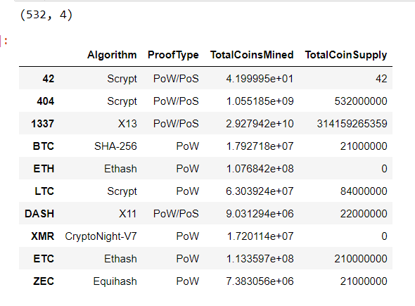
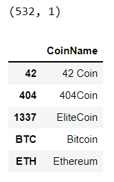
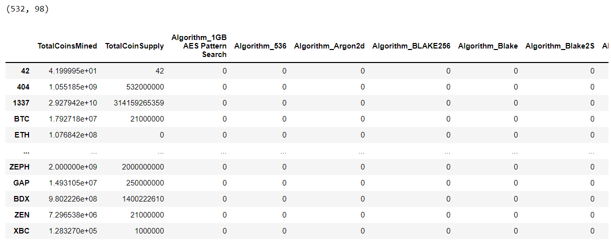
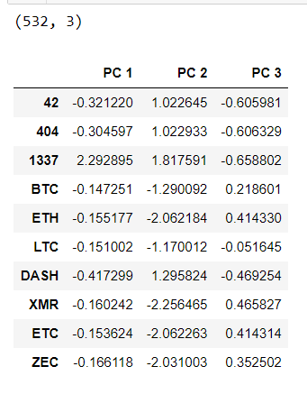
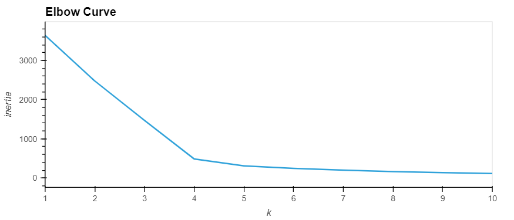
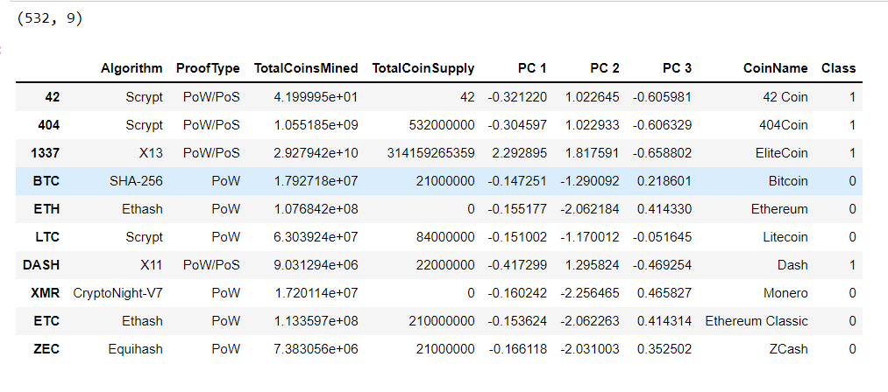
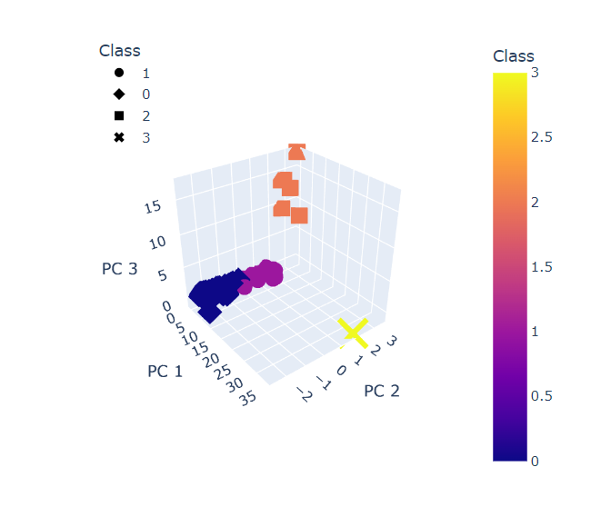
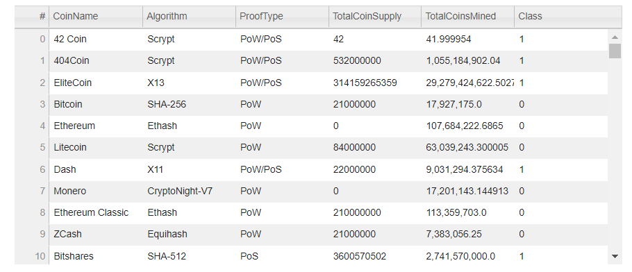
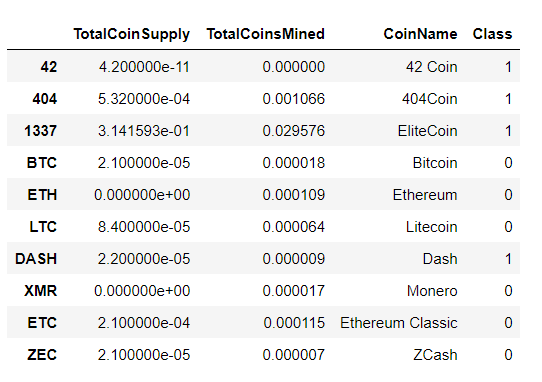
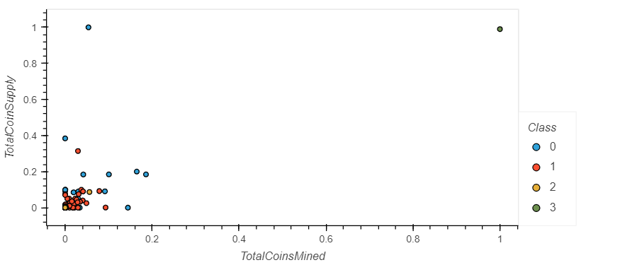

# Cryptocurrencies

## Overview

Accountability Accounting, a prominent investment bank, is interested in offering a new cryptocurrency investment portfolio for its customers. The company, however, is lost in the vast universe of cryptocurrencies. So, they’ve asked you to create a report that includes what cryptocurrencies are on the trading market and how they could be grouped to create a classification system for this new investment.

The data Martha will be working with is not ideal, so it will need to be processed to fit the machine learning models. Since there is no known output for what Martha is looking for, she has decided to use unsupervised learning. To group the cryptocurrencies, Martha decided on a clustering algorithm. She’ll use data visualizations to share her findings with the board.

### Resources

#### Data 

- crypto_data.csv

#### Software Tools

- [Jupyter Notebook v6.4.6](https://jupyter-notebook.readthedocs.io/en/stable/index.html)
- [SciKit-Learn Library v 1.0.2](https://scikit-learn.org/stable/getting_started.html)
  - [Principal component analysis (PCA)](https://scikit-learn.org/stable/modules/generated/sklearn.decomposition.PCA.html)
  - [K-Means Clustering](https://scikit-learn.org/stable/modules/generated/sklearn.cluster.KMeans.html)
  - [MinMaxScaler](https://scikit-learn.org/stable/modules/generated/sklearn.preprocessing.MinMaxScaler.html#sklearn.preprocessing.MinMaxScaler.fit_transform)
- Visualization Modules
  - [plotly scatter plots](https://plotly.com/python-api-reference/generated/plotly.express.scatter_3d.html#plotly-express-scatter-3d)
  - [hvplots customization](https://hvplot.holoviz.org/user_guide/Customization.html)

## Results

Data was preprocessed prior to use in PCA algorithm. The transformed dataframe `crypto_df` kept all the cryptocurrencies that are being traded, dropped the `IsTrading` column,
remove null values, filtered for rows where coins have been mined, and removed the `CoinName` column.



A new DataFrame that holds only the cryptocurrency names and uses the same index as `crypto_df` was created.



The data was encoded using the `get_dummies()` method, and concatenated into a new Dataframe `X`.



Using the PCA algorithm, the encoded data was scaled and reduced to three components in the PCA model.

```Python
X_scaled = StandardScaler().fit_transform(X)
```
```Python
pca = PCA(n_components=3)
cc_pca = pca.fit_transform(X_scaled)
```



Once the DataFrame has been reduced to three, scaled components, it can be used in the K-Means algorithm. 

An elbow curve was created to estimate the best value for `K`

```Python
# Create an elbow curve to find the best value for K.
inertia = []
k = list(range(1, 11))

# Calculate the inertia for the range of K values
for i in k:
    km = KMeans(n_clusters=i, random_state=1)
    km.fit(pcs_df)
    inertia.append(km.inertia_)
```
```Python
elbow_data = {"k": k, "inertia": inertia}
df_elbow = pd.DataFrame(elbow_data)
df_elbow.hvplot.line(x="k", y="inertia", title="Elbow Curve", xticks=k)
```



Using the `elbow curve` as a reference and the `pcs_df` as input data, a `KMeans` model was initiated, trained, and predicted.

```Python
# Initialize the K-Means model.
model = KMeans(n_clusters=4, random_state=1)

# Fit the model
model.fit(pcs_df)

# Predict clusters
predictions = model.predict(pcs_df)
```

A new DataFrame named `clustered_df` was created by concatenating the `crypto_df` and `pcs_df` DataFrames on the same columns.

```Python
# Create a new DataFrame including predicted clusters and cryptocurrencies features.
# Concatentate the crypto_df and pcs_df DataFrames on the same columns.
clustered_df = crypto_df.join(pcs_df, how="inner")

#  Add a new column, "CoinName" to the clustered_df DataFrame that holds the names of the cryptocurrencies. 
clustered_df['CoinName'] = coin_names_df['CoinName']

#  Add a new column, "Class" to the clustered_df DataFrame that holds the predictions.
clustered_df["Class"]= model.labels_
```



These data can be visualized in 3 dimension using:
```Python
# Creating a 3D-Scatter with the PCA data and the clusters
fig = px.scatter_3d(
    clustered_df,
    x="PC 1",
    y="PC 2",
    z="PC 3",
    color="Class",
    symbol="Class",
    width=500,
    hover_name = 'CoinName',
    hover_data = ['Algorithm','CoinName']
)
fig.update_layout(legend=dict(x=0, y=1))
fig.show()
```



Results can also be viewed in tabular form:

```Python
# Create a table with tradable cryptocurrencies.
clustered_df.hvplot.table(columns=['CoinName','Algorithm','ProofType','TotalCoinSupply','TotalCoinsMined','Class'], sortable=True, selectable=True)
```



Since the `TotalCoinsMined` and `TotalCoinSupply` are wildly distributed, the `MinMaxScaler().fit_transform` method was used.

```Python
# Scaling data to create the scatter plot with tradable cryptocurrencies.
scaler = MinMaxScaler().fit_transform(clustered_df[['TotalCoinSupply','TotalCoinsMined']])
scaler
```

The scaled data was added to a dataframe.

```Python
# Create a new DataFrame that has the scaled data with the clustered_df DataFrame index.
plot_df = pd.DataFrame(
    data = scaler,
    columns= ['TotalCoinSupply','TotalCoinsMined'],
    index = X.index
)
# Add the "CoinName" column from the clustered_df DataFrame to the new DataFrame.
plot_df['CoinName'] = clustered_df['CoinName']

# Add the "Class" column from the clustered_df DataFrame to the new DataFrame. 
plot_df['Class'] = clustered_df['Class']
```


Lastly, a scatter plot can show the distribution of `TotalCoinSupply` and `TotalCoinsMined`

```Python
# Create a hvplot.scatter plot using x="TotalCoinsMined" and y="TotalCoinSupply".
plot_df.hvplot.scatter(x="TotalCoinsMined", y="TotalCoinSupply", by="Class", hover_cols = 'CoinName', line_color='k')
```


